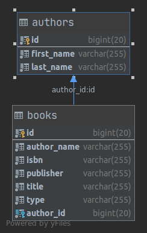

# Spring-MVC-REST
Aplikacja zapewnia funkcjonalność beckendową do katalogowanie książek i autorów metodą REST.

Do stworzenia API wykorzystano m.in.: Spring MVC, Spring Data, Jackson, Hibernate Core i Hibernate Validator.

Aplikacja zawiera dwa kontrolery: BookController oraz AuthorController. 
Kontrolery te wykorzystują serwisy implementujące przetwarzanie danych z użyciem bazy MySQL. 

Dane z REST API przed zapisem do bazy poddawane są walidacji. 

### BookController akcje: 
#### Pobieranie listy danych: GET [serverName]/books
Zwraca listę wszystkich książek dostępnych w bazie danych.

Przykładowy JSON:
````json
[
    {
        "id": 4,
        "isbn": "ISBN: 9781617294945",
        "title": "Hibernate in Action",
        "author": {
            "id": "12",
            "firstName": "CHRISTIAN",
            "lastName": "BAUER",
            "fullName": "CHRISTIAN BAUER"
        },
        "authorName": "CHRISTIAN BAUER",
        "publisher": "ISBN: 9781617294945",
        "type": "programming"
    },
    {
        "id": 5,
        "isbn": "978-161-729-045-9",
        "title": "Effective Java",
        "author": {
            "id": "13",
            "firstName": "Joshua ",
            "lastName": "Bloch",
            "fullName": "Joshua  Bloch"
        },
        "authorName": "Joshua Bloch",
        "publisher": "978-161-729-045-9",
        "type": "programming"
    },
    {
        "id": 6,
        "isbn": "ISBN: 9781617294945",
        "title": "Spring in Action",
        "author": {
            "id": 14,
            "firstName": "CRAIG ",
            "lastName": "WALLS",
            "fullName": "CRAIG  WALLS"
        },
        "authorName": "CRAIG WALLS",
        "publisher": "ISBN: 9781617294945",
        "type": "programming"
    }
]
````
#### Pobieranie obiektu po wskazanym identyfikatorze: GET [serverName]/id 
Zwraca wybraną książkę na podstawie przekazanego parametru id .

Przykładowy JSON:

````json
{
    "id": 4,
    "isbn": "ISBN: 9781617294945",
    "title": "Hibernate in Action",
    "author": {
        "id": 12,
        "firstName": "CHRISTIAN",
        "lastName": "BAUER",
        "fullName": "CHRISTIAN BAUER"
    },
    "authorName": "CHRISTIAN BAUER",
    "publisher": "ISBN: 9781617294945",
    "type": "programming"
}
````
#### Dodawanie obiektu: POST [serverName]/books
Dodaje przekazaną w formacie JSON książkę do bazy danych.
Jeżeli autor przypisany do książki nie istnieje w bazie danych, 
zostanie do niej zapisany (autor jest wyszukiwany po swoim id, a jeśli go brak to po imieniu i nazwisku);

Przykładowy JSON:

a) zawierający imię i nazwisko autora:
````json
 {
        "id": 5,
        "isbn": "978-161-729-045-9",
        "title": "Effective Java",
        "authorName": "Joshua Bloch",
        "publisher": "978-161-729-045-9",
        "type": "programming"
    }
````
LUB

b) zawierający pole autora z jego id:
````json
 {
        "id": 0,
        "isbn": "ISBN: 9781617294945",
        "title": "Hibernate in Action",
        "author": {
            "id": 12
        },
        "publisher": "ISBN: 9781617294945",
        "type": "programming"
    }
````

#### Edycje obiektu: PUT [serverName]/books/id
Wyszukuje książkę po id ze ścieżki, a następnie ją modyfikuje na 
podstawie danych przekazanych w formacie JSON.
Jeżeli autor przypisany do książki nie istnieje w bazie danych, 
zostanie do niej zapisany.

Przykładowy JSON

````json
{
        "id": 0,
        "isbn": "978-161-729-045-9",
        "title": "Effective Java",
        "authorName": "Joshua Bloch",
        "publisher": "978-161-729-045-9",
        "type": "programming"
    }
````
LUB

````json
 {
        "id": 0,
        "isbn": "ISBN: 9781617294945",
        "title": "Hibernate in Action",
        "author": {
            "id": 12
        },
        "publisher": "ISBN: 9781617294945",
        "type": "programming"
    }
````
#### Usuwanie obiektu: DELETE [serverName]/books/id
Wyszuka, a następnie usunie książkę na podstawie
przekazanego id. 

### AuthorController akcje: 
#### Pobieranie listy danych: GET [serverName]/authors
Zwraca listę wszystkich autorów dostępnych w bazie danych.

Przykładowy JSON:

````json
[
    {
        "id": 12,
        "firstName": "CHRISTIAN",
        "lastName": "BAUER",
        "fullName": "CHRISTIAN BAUER"
    },
    {
        "id": 13,
        "firstName": "Joshua ",
        "lastName": "Bloch",
        "fullName": "Joshua  Bloch"
    },
    {
        "id": 14,
        "firstName": "CRAIG ",
        "lastName": "WALLS",
        "fullName": "CRAIG  WALLS"
    }
]
````

#### Pobieranie obiektu po wskazanym identyfikatorze: GET [serverName]/id 
Zwraca wybranego autora na podstawie przekazanego parametru id .

Przykładowy JSON:

````json
{
    "id": 12,
    "firstName": "CHRISTIAN",
    "lastName": "BAUER",
    "fullName": "CHRISTIAN BAUER"
}
````

#### Dodawanie obiektu: POST [serverName]/authors
Dodaje przekazanego w formacie JSON autora do bazy danych.

Przykładowy JSON:
````json
 {
        "id": 0,
        "firstName": "Joshua ",
        "lastName": "Bloch",
    }

````

#### Edycje obiektu: PUT [serverName]/authors/id
Wyszukuje autora po id ze ścieżki, a następnie go modyfikuje na 
podstawie danych przekazanych w formacie JSON.

Przykładowy JSON

````json
 {
        "id": 0,
        "firstName": "Joshua",
        "lastName": "Bloch"
    }
````
#### Usuwanie obiektu: DELETE [serverName]/authors/id
Wyszuka, a następnie usunie autora na podstawie przekazanego id. 

### Walidacja podczas edycji/dodawania
#### Obiekt Book 
Walidacja obejmuje:
* isbn - pole wymagane, sprawdzenie poprawności nr ISBN; 
* title, authorName, publisher, type - pola wymagane, maksymalnie 255 znaków,
 nie mogą być białymi znakami; 
* title, authorName, type - minimalna liczba znaków odpowiednio: 3, 2, 2. 
#### Obiekt Author
Walidacja obejmuje: 
* firstName i lastName - nie mogą składać się tylko z białych znaków, maksymalna długość 255.

Struktura bazy danych 
------------------------------------------------------------------------------------------------------------------------



